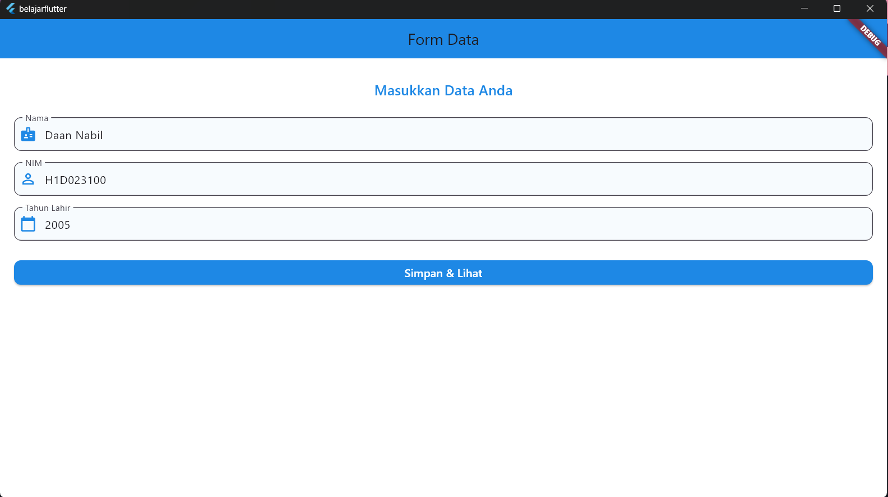
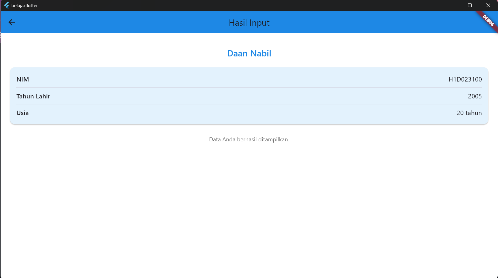

# Data Diri

Nama : Daan Nabil
NIM : H1D023100
Shift Lama : I
Shift Baru : F

# Screenshoot

# Alur

1. Input Data 
Pengguna mengisi form di `FormDataPage` menggunakan `TextEditingController` untuk `nama`, `nim`, dan `tahunLahir`.

2. Validasi & Kirim Data
Setelah tombol "Simpan & Lihat" ditekan, fungsi `_simpan()` akan memvalidasi data, lalu mengirimnya ke `TampilDataPage`

3. Terima & Tampilkan Data
TampilDataPage menerima data lewat konstruktor, Data kemudian ditampilkan di tampilan, dan usia dihitung otomatis

